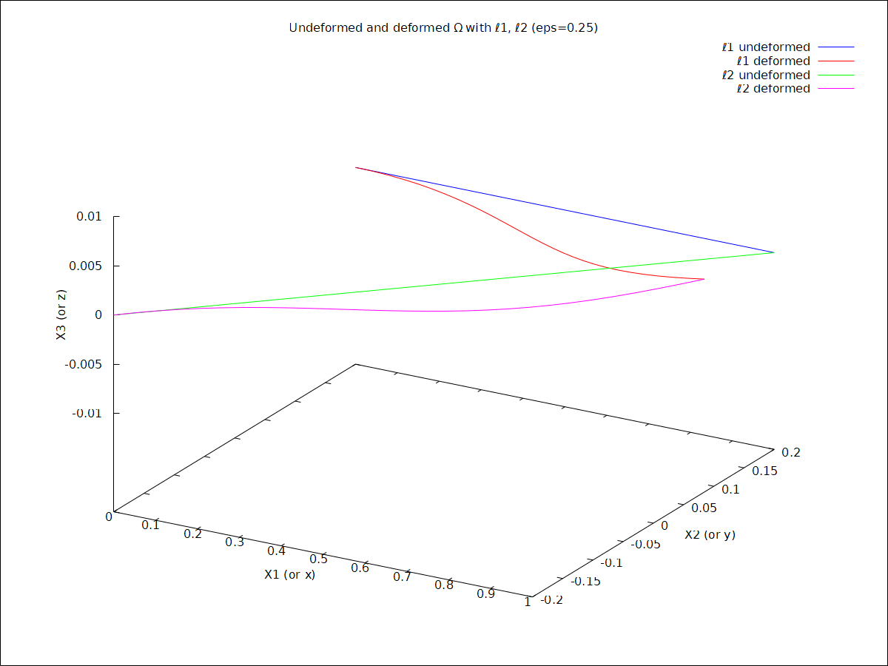

# 3.1(d) in wxMaxima

## Define displacement field u*

```
load("draw")$ 
u1s(X1,X2) := 0.1*X1 + 0.8*X2*sin(4*X1) - 0.2*X1*sin(5*X2);
u2s(X1,X2) := 0.2*(cos(4*X1) - 1);
u3s(X1,X2) := 0;
```

## Deformation map: x = X + eps*u*

```
x1(X1,X2,X3,eps) := X1 + eps*u1s(X1,X2);
x2(X1,X2,X3,eps) := X2 + eps*u2s(X1,X2);
x3(X1,X2,X3,eps) := X3 + eps*u3s(X1,X2);
```

## Pick eps = 0.25

```
eps_val : 0.25;
```

# Define the two lines in reference

## Line ℓ1: X1 in [0,1], X2=0.2, X3=0

```
ell1_ref : parametric(t, 0.2, 0, t, 0, 1);
ell1_def : parametric(x1(t,0.2,0,eps_val), x2(t,0.2,0,eps_val), x3(t,0.2,0,eps_val), t, 0, 1);
```

## Line ℓ2: X1 in [0,1], X2=0.4*X1-0.2, X3=0

```
ell2_ref : parametric(t, 0.4*t-0.2, 0, t, 0, 1);
ell2_def : parametric(x1(t,0.4*t-0.2,0,eps_val), x2(t,0.4*t-0.2,0,eps_val), x3(t,0.4*t-0.2,0,eps_val), t, 0, 1);
```

## --- Plot all curves together ---

```
wxdraw3d(
    title = "Undeformed and deformed Ω with ℓ1, ℓ2 (eps=0.25)",
    xlabel="X1 (or x)", ylabel="X2 (or y)", zlabel="X3 (or z)",
    key="ℓ1 undeformed", color=blue, ell1_ref,
    key="ℓ1 deformed",   color=red, ell1_def,
    key="ℓ2 undeformed", color=green, ell2_ref,
    key="ℓ2 deformed",   color=magenta, ell2_def
);
```


